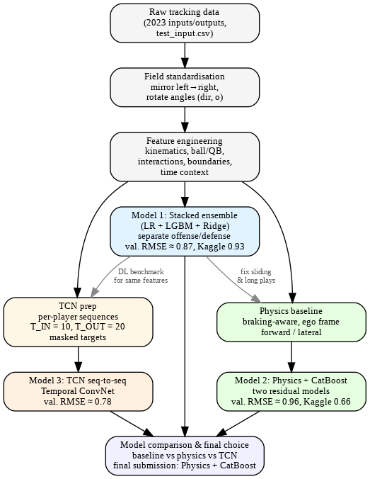

# Machine Learning Project – NFL Big Data Bowl 2026

## Contributors:

- Ali Lamine
- Andrea Maza-León
- Brian William Hingpit
- Juan Vanegas Jadan
- Pál Sóvág
- Samuel Nadrchal

## Project Overview

This repository contains our course project for the Machine Learning class at Hasselt University. The goal was to analyze and develop a machine learning solution for the Kaggle Challenge: **NFL Big Data Bowl 2026 – Prediction**.

## Repository Structure
The repository is organized into three folders, each containing a different model we developed:

- [Stacked Model](./Stacked)
- [TCN Model](./TCN)
- [CatBoost Model](./Catboost)

## Final Model

Our final and best-performing model was the CatBoost Model, developed according to the following workflow:

